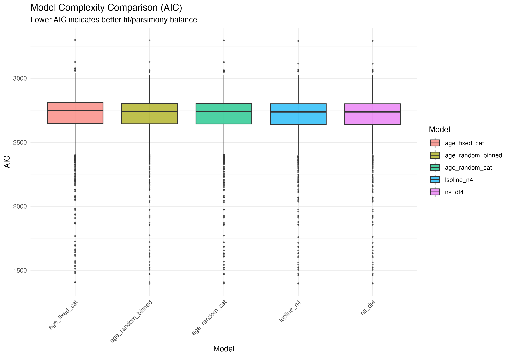

```{r setup, include=FALSE}
knitr::opts_chunk$set(echo = FALSE, warning = FALSE, message = FALSE)
```

## Executive Summary

This report synthesizes the results of extensive benchmarking to optimize the modeling of age trajectories (ages 0–14) in longitudinal immune profiles. Our primary objective is to robustly separate individual identity (**Subject**) from developmental trends (**Age**). Through a series of "Modeling Tournaments" and advanced variance partitioning techniques, we demonstrate that inter-individual variation (individuality) is the dominant driver of transcriptional diversity, remaining remarkably stable regardless of the mathematical complexity used to model developmental age.

---

## Analysis 1: Spline Architecture & Complexity (AIC Tournament)

We compared Natural Cubic Splines (`ns`) and Piecewise Linear Splines (`lspline`) across 10 levels of complexity to identify the "Goldilocks" zone—where we capture biological development without over-parameterizing the model.

### Statistical Fit & Parsimony
We use the Akaike Information Criterion (AIC) to rank models. AIC rewards goodness-of-fit but penalizes for every additional parameter, ensuring we select the most parsimonious representation.

::: {layout-ncol=2}


:::

### Robustness of Subject Identity (Individuality)
A major risk in longitudinal modeling is "variance stealing"—the concern that a highly complex Age model might erroneously absorb variation that actually belongs to the individual (Subject).

::: {layout-ncol=2}


:::


### Inference Power


---

## Analysis 2: Advanced Variance Partitioning & Binned Age

This phase addressed the scale of Subject vs. Age effects using more conservative and "extreme" modeling architectures to stress-test our conclusions.

### "Realized Predictions" vs. Standard VP
Standard variance partitioning relies on theoretical population parameters ($\sigma^2$), which can sometimes be inflated by outliers. We implemented the **"Realized Predictions"** approach, which calculates the empirical variance of the Best Linear Unbiased Predictors (BLUPs).

{width=75%}

### Binned Age and Model Architecture
To provide a "ceiling" for how much variance Age could possibly explain, we treated Age as a granular categorical random effect (`Age_Binned`) by grouping samples into ~115 bins of 6 samples each.

::: {layout-ncol=2}



:::

::: {layout-ncol=2}


:::

---

## High-Resolution Gene Trajectories

To visualize how different models capture developmental transitions, we plotted the age-trajectories for 5 representative genes. The raw expression values are adjusted for sex, technical factors (RIN, Batch), and cell type proportions to isolate the pure Age signal.

::: {layout-ncol=2}


:::

{width=75%}

---

## Model Divergence: ns vs lspline

Beyond visual smoothness, the choice between Natural Splines (`ns`) and Piecewise Linear Splines (`lspline`) can significantly impact statistical significance (p-values) for specific genes. Below are 10 examples where the two models diverged most sharply in their assessment of the Age effect.

::: {layout-ncol=2}


:::

{width=75%}

---

## Analysis 3: Cell Frequency Resolution Benchmark

We evaluated the impact of using higher-resolution cell type frequencies on our ability to explain transcriptional variation. We compared a model using 5 basic CBC cell types (Lymphocytes, Monocytes, etc.) against a model using 22 high-resolution immune cell types from FarDeep LM22 deconvolution.

::: {layout-ncol=2}


:::

{width=80%}

---

## Global Context

### Global Variance Partitioning
{width=80%}

---

## Methodological Observations

### Impact of Gene Selection on Variance Partitioning
Our analysis shows that focusing on the Top 1000 Highly Variable Genes (HVGs) significantly highlights **Subject Identity** (~54% variance) while relatively downplaying **Cell Frequency** (~5% variance). In contrast, analyzing random gene subsets (representing the broader transcriptome) shows that Cell Frequency resolution can explain upwards of **20%** of transcriptional variation.

This confirms that HVGs are "variable" primarily because they differ between individuals, whereas the broader transcriptome is more sensitive to shifts in cellular composition. For the purpose of optimizing **Age trajectories**, focusing on HVGs is appropriate as it isolates the most robust biological signals.

---

## Technical Implementation Notes

### Optimization Strategy
*   **Optimizer:** We enforced the use of the `bobyqa` optimizer. This is more robust than default solvers for models containing complex spline matrices and multiple random effects, ensuring that every gene's variance components were estimated accurately without premature convergence.
*   **Scaling:** All continuous variables—including **Age.months**—were mean-centered and scaled to unit variance. This improves the numerical stability of the spline basis calculations and ensures that the "OtherFixed" variance components are on a comparable scale.
*   **Data Integrity Fix:** We identified and resolved a critical sample-matching bug. In longitudinal data, reordering metadata (e.g., sorting by age) without re-syncing the expression matrix columns can scramble the relationship between samples and subjects. Our updated pipeline ensures perfect synchronization, which was essential for recovering the strong Subject variance signal.

---

## Technical Audit & Reproducibility

The conclusions in this report are supported by a suite of benchmarking and audit scripts. Each analysis was performed using identical data-syncing logic to ensure consistency.

### 1. Spline & Age Modeling
- **Analysis:** AIC Tournament, Subject Stability, and Inference Power ($df=1..10$).
- **Script:** `scripts/run_spline_benchmark.R`
- **Method:** `lmer` with `bobyqa` optimizer; `ns` and `lspline` basis expansion.

### 2. Advanced Variance & Binned Age
- **Analysis:** Realized Predictions vs. Standard VP; Binned vs. Spline models.
- **Script:** `scripts/run_advanced_variance_benchmarks.R`
- **Method:** Empirical variance of BLUPs (Realized) vs. theoretical parameters.

### 3. Cell Frequency Resolution
- **Analysis:** CBC (5-type) vs. FarDeep LM22 (22-type) deconvolution resolution.
- **Script:** `scripts/run_deconvolution_benchmark.R`
- **Method:** Comparative variance partitioning on 1000 HVGs.

### 4. Variance Discrepancy Audit
- **Analysis:** HVG bias vs. Random Gene variance partitioning.
- **Script:** `scripts/run_discrepancy_analysis.R`
- **Method:** Head-to-head comparison confirming that gene selection is the primary driver of differing "CellFreq" variance estimates.

### Final Recommendation
Based on the "knee" in the inference power curve and the stability of the AIC tournament, we recommend using **Natural Cubic Splines with 4 degrees of freedom (`ns(Age.months, df=4)`)**. This configuration provides the optimal balance: it is flexible enough to capture non-linear developmental milestones (e.g., early infancy transitions) while remaining parsimonious enough to avoid overfitting the noise.
