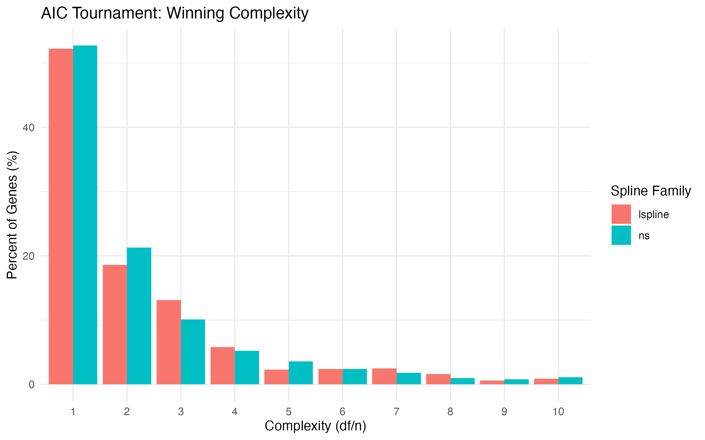
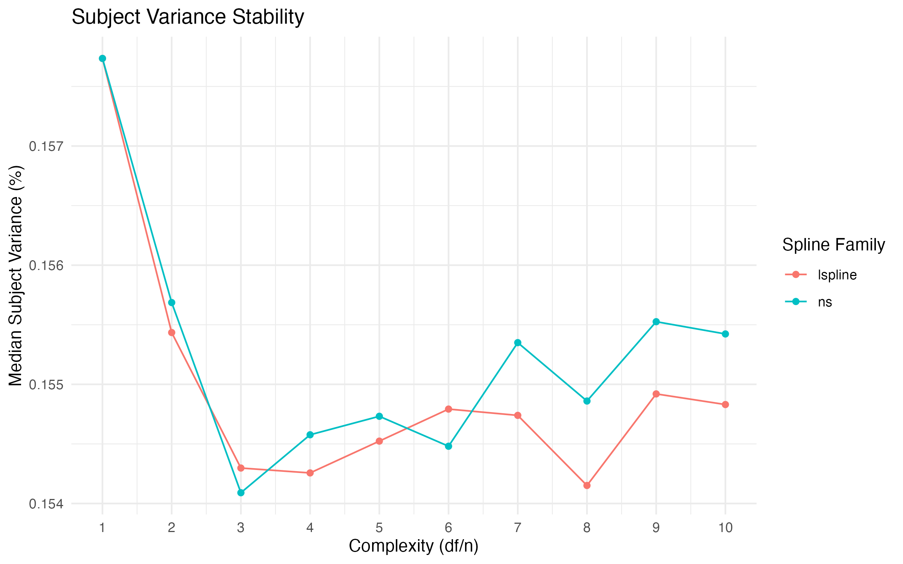
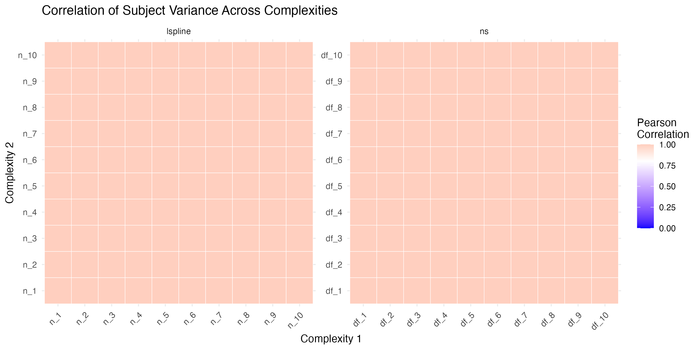
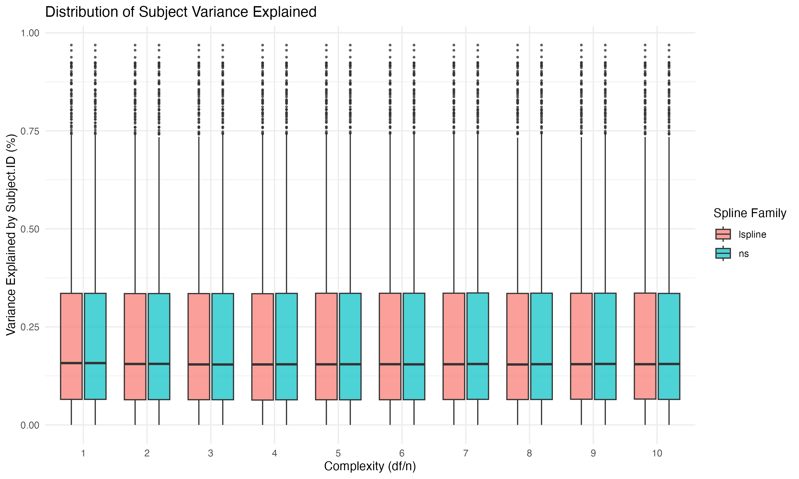
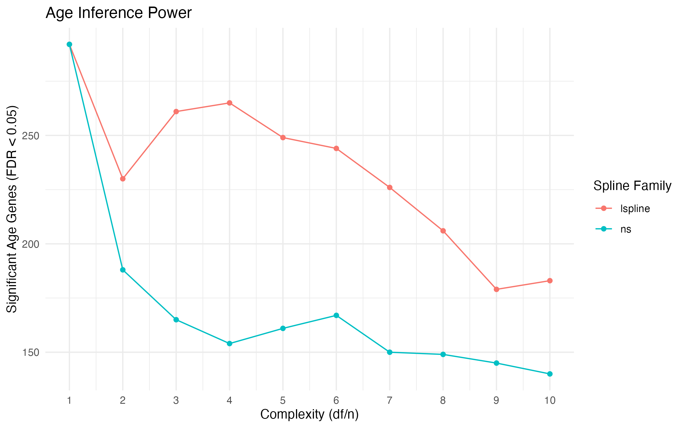
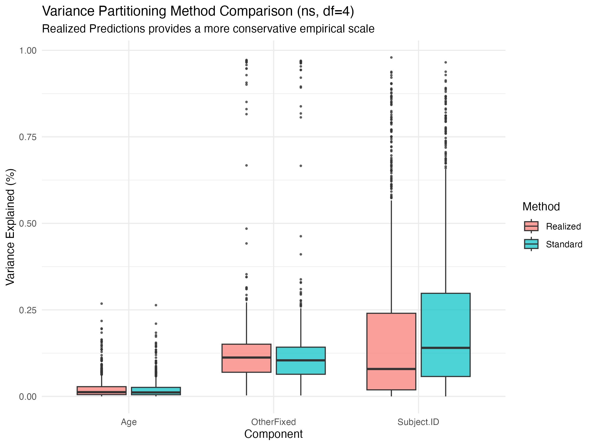
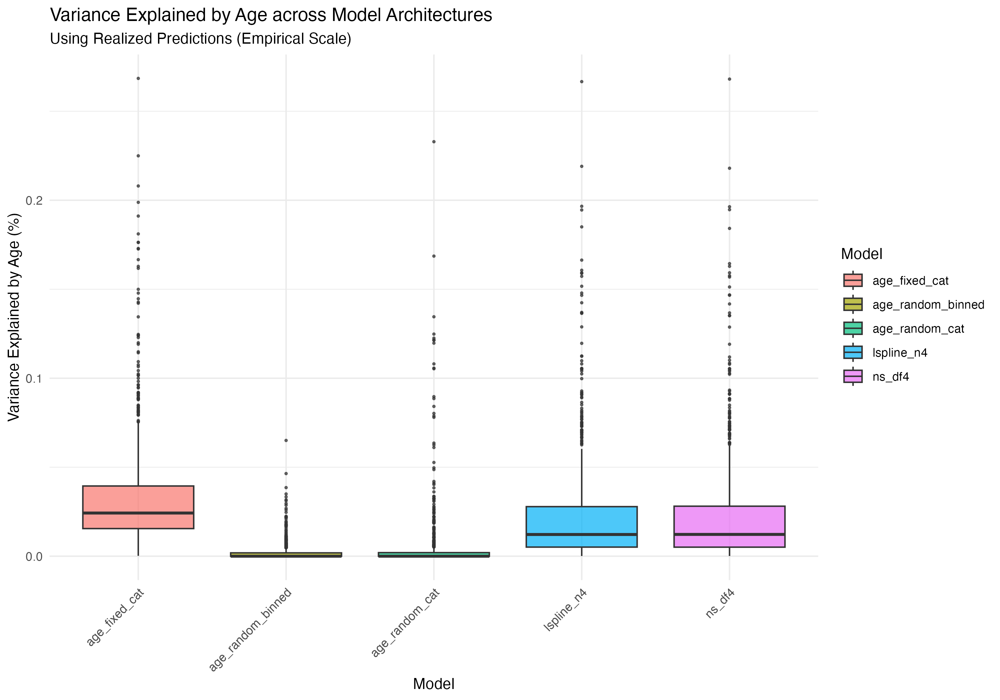
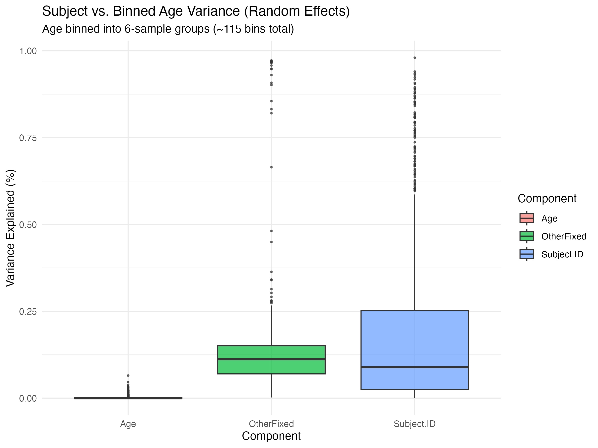
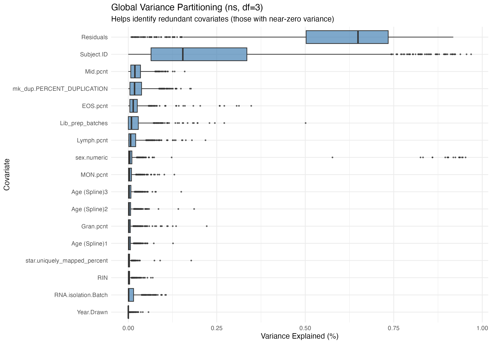

```{r setup, include=FALSE}
knitr::opts_chunk$set(echo = FALSE, warning = FALSE, message = FALSE)
```

## Executive Summary

This report synthesizes the results of extensive benchmarking to optimize the modeling of age trajectories (ages 0–14) in longitudinal immune profiles. We evaluate spline families, complexity, and variance partitioning methodologies to robustly separate individual identity (*Subject*) from developmental trends (*Age*).

---

## Analysis 1: Spline Architecture & Complexity (AIC Tournament)

We compared Natural Cubic Splines (`ns`) and Piecewise Linear Splines (`lspline`) across 10 levels of complexity (df/knots).

### Statistical Fit & Parsimony
The "AIC Tournament" evaluates which complexity best fits the data while penalizing for over-parameterization.

::: {layout-ncol=2}



:::

### Robustness of Subject Identity
A critical concern was whether increasing age complexity would "steal" variance from the Subject component.

::: {layout-ncol=2}



:::



### Inference Power


---

## Analysis 2: Advanced Variance Partitioning & Binned Age

This phase addressed the scale of Subject vs. Age effects using categorical and empirical approaches.

### "Realized Predictions" vs. Standard VP
We compared the **Standard** (population-level $\sigma^2$) approach to the **Realized Predictions** (empirical BLUP variance) method.

{width=75%}

### Binned Age and Model Architecture
We tested treating Age as a granular categorical random effect (`Age_Binned`, ~115 groups) and compared different architectures using AIC.

::: {layout-ncol=2}



:::

{width=70%}

---

## Global Context

### Global Variance Partitioning
{width=80%}

---

## Technical Implementation Notes

### Optimization Strategy
*   **Optimizer:** All models were fit using the `bobyqa` optimizer via `lmerControl`, which provided superior convergence for complex spline terms compared to default solvers.
*   **Scaling:** All continuous variables, including **Age.months**, were scaled and centered. This ensures that variance components are comparable and prevents numerical instability in the spline basis matrices.
*   **Data Integrity:** A sample mismatch bug was identified and resolved by re-syncing the expression matrix rows to the metadata order after age-based sorting.

### Final Recommendation
The optimal model for capturing both smooth developmental trends and robust individual differences is:
`~ (1|Subject.ID) + ns(Age.months, df=4) + (1|Batch) + [Cell Percentages] + [Technical Factors]`
